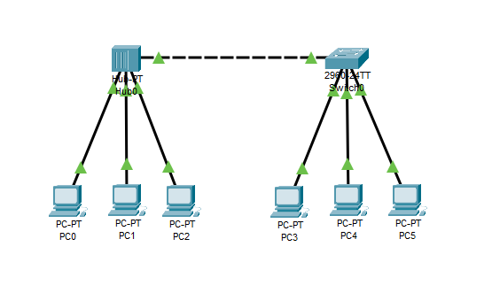
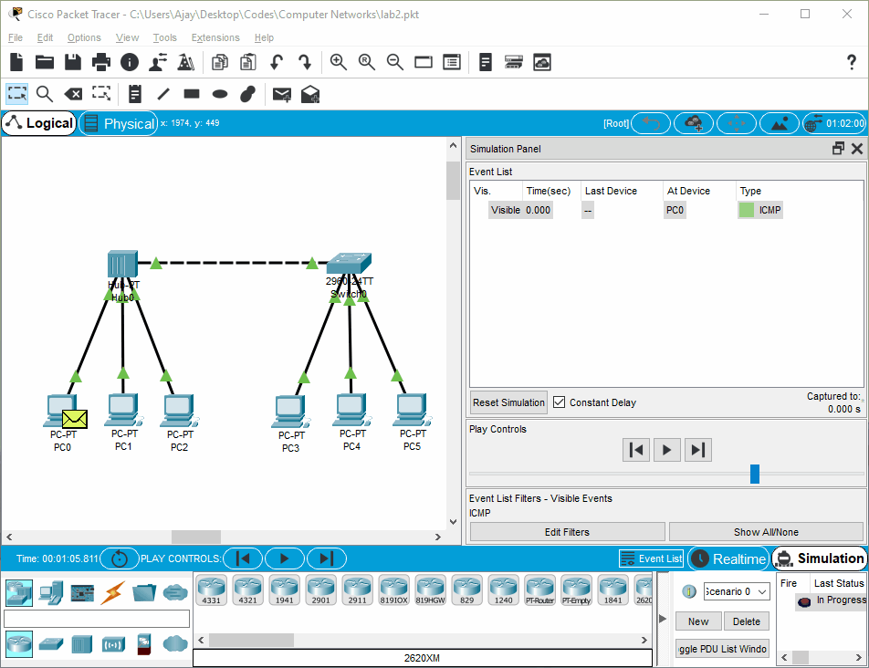

# Hub-Switch Connection

## Observations/Learnings
- Configuring a hub and a switch
- Connecting network end devices such as PCs to the hub and switch respectively
- Simulating an ICMP packet ping

### Topology

### PDU Packet Simulation

