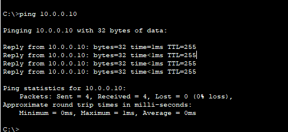

# Router

## Aim
To configure a router and ping the gateway

## Observations/Learning
- Creating a topology and connecting 2 PCs to it on 2 different ports
- Configuring a router's interfaces using `configure terminal`, `interface`, `ip address` commands. `no shutdown` to prevent the link from shutting down
- Viewing PC config using `ipconfig` and pinging the gateway using `ping` command

## Images/Videos
### Connection

### Router Config

### PC6 Config

### PC6-Gateway Ping

### PC7 Config

### PC7-Gateway Ping

### PC6-PC7 Ping

### Ping GIF
