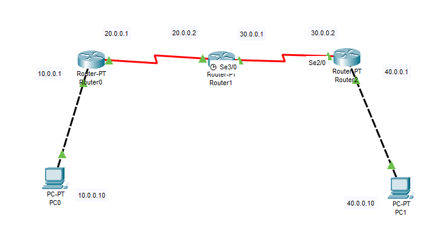
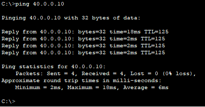
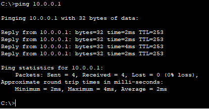
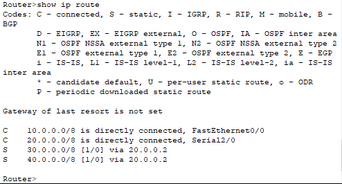
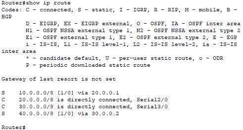
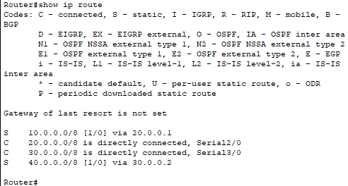

# Configuring Static Routes in a Multiple Router Topology

## Observations/Learnings
1. Creating a multiple router topology by connecting routers through _serial ports_ and PC-router through _fast ethernet_.
2. Assigning ip addresses(gateway) to routers using the same method as in [lab2](../lab2/observation.md) and PCs
3. Pinging PC1 from PC0 at this state gives **destination host unreachable**
4. Viewing the routers ip routes using `show ip route`
5. Adding static routes to the routers using `ip route <dest. network> <subnet mask> <next hop>` in privileged (`enable`) configure (`configure terminal`) mode.
6. Pinging PC1 from PC0 and PC0 from PC1 now works as expected.

## Topology

## PC0-PC1 Ping

## PC1-PC0 Ping

## Router 0 IP Route

## Router 1 IP Route

## Router 2 IP Route

