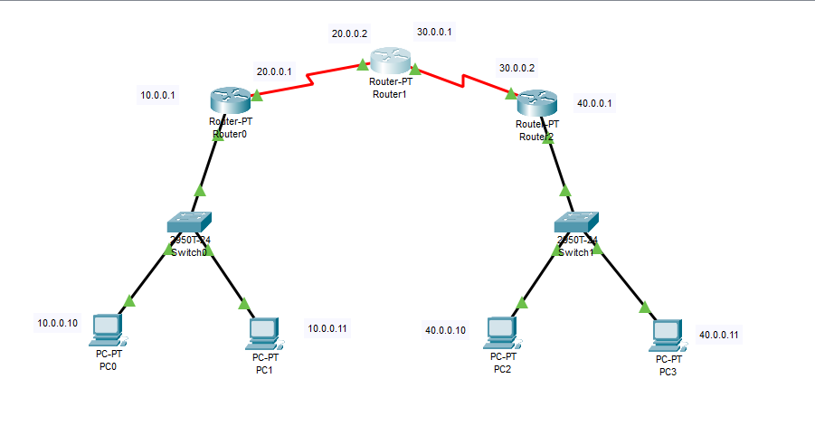

# Configure Default Route in a Router

## Observations/Learnings
- A toplogy was created using three Routers, two Switchs and two PC's connected to each switch using copper straight-through connections and serial DCE connections
- Assigning ip addresses(gateway) to routers using the same method as in [lab2](../lab2/router-config/observation.md) and PCs
- Assigning static routes to router 1 as done in [lab3](../lab3/observation.md)
- Viewing the routers ip routes using `show ip route`
- Adding static routes to router 1 using `ip route <dest. network> <subnet mask> <next hop>` in privileged (`enable`) configure (`configure terminal`) mode
- Configuring default gateway to routers 0 and 2 using `ip route 0.0.0.0 0.0.0.0 <next hop>` in privileged (`enable`) configure (`configure terminal`) mode.

### Topology

### Router 0 Default Route

### Router 1 Static Route

### Router 2 Default Route

### PC0 - PC3 Ping

### PC2 - PC1 Ping

