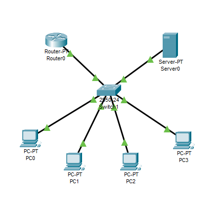
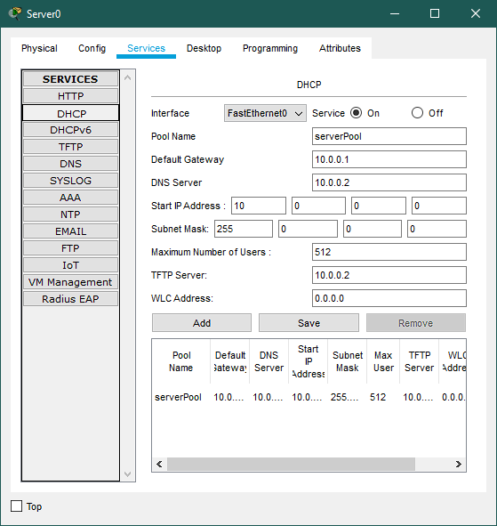
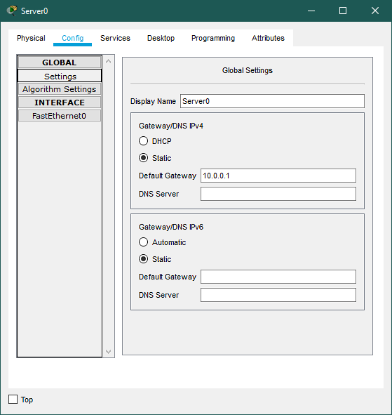
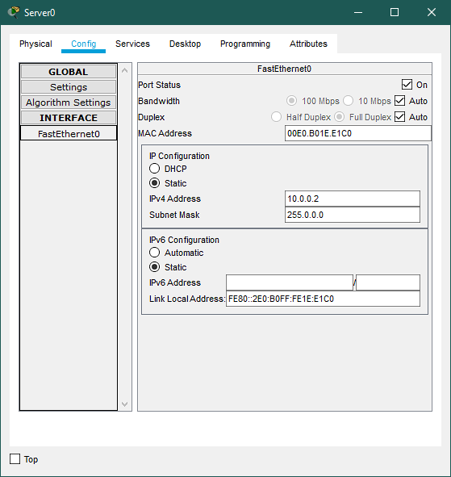
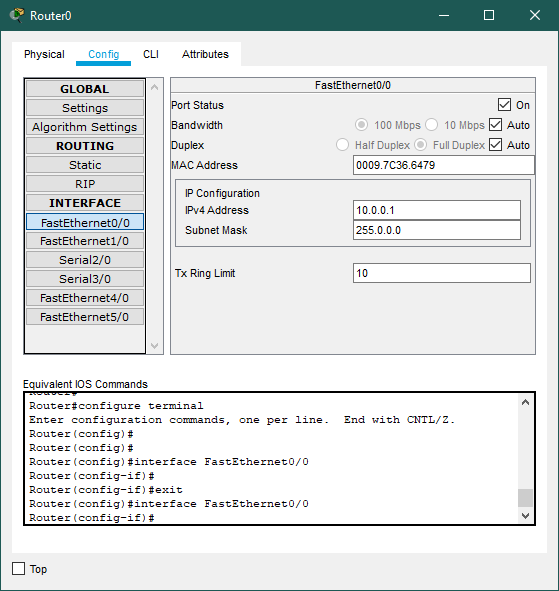
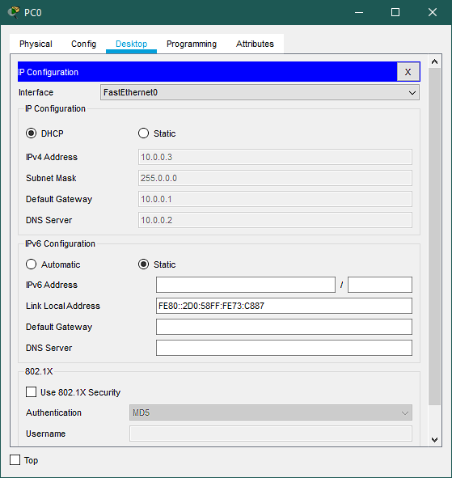

# Configuring and Setting up a DHCP Server

## Observations/Learnings
- A toplogy was created using a Router, a Switch, a Server and four PC's connected as shown in the figure
- Router was configured as done in [lab 2](../../lab2/router-config/observation.md)
- Server was assigned IP address and DHCP service was turned on and configured
- DHCP issued IP address to PC using DORA process

### Topology

### Server DHCP Config

### Server IP Config

### Router Config

### PC IP Config

