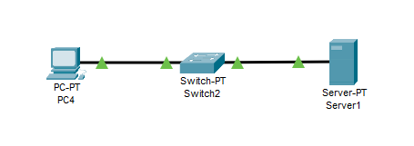
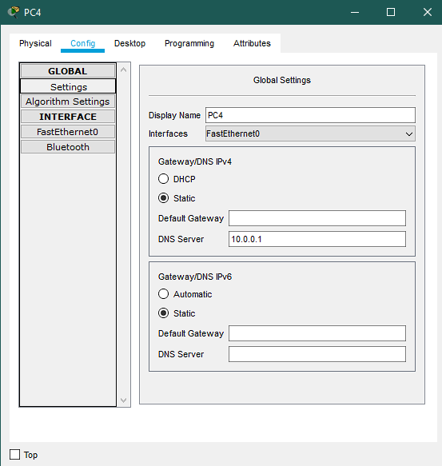
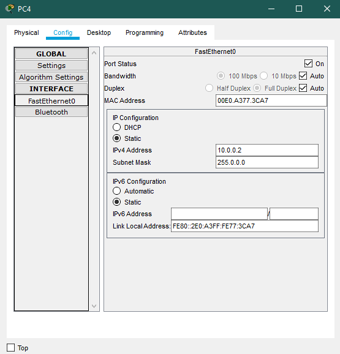
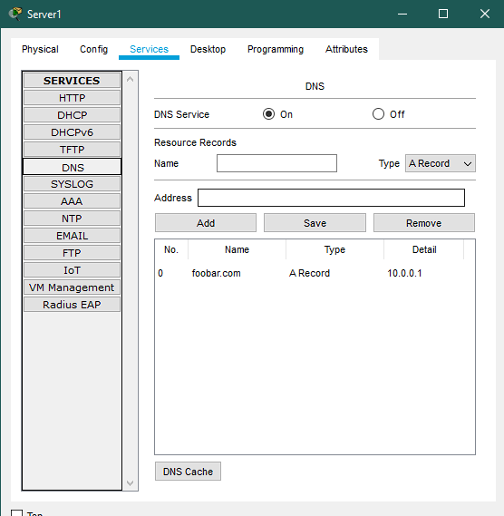
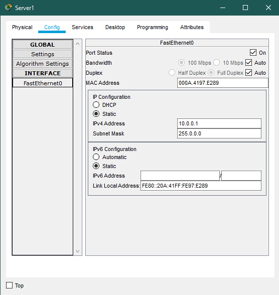
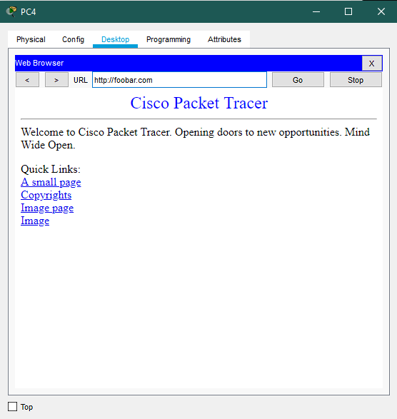

# Configuring Web Server and DNS

## Observations/Learnings
- A toplogy was created using a Switch, a Server and a PC connected as shown in the figure
- Ensure HTTP services are on
- Turn on DNS service and enter type A Record with resource name and address.
- DNS Service was tested by visiting the site using its name on the PC

### Topology

### PC DNS Config

### PC IP Config

### Server DNS Records

### Server IP Config

### Visiting Site using its Hostname

