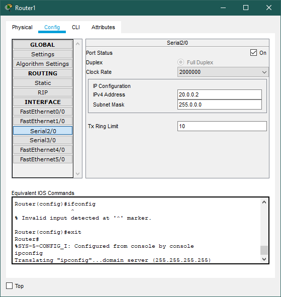

# Configure RIP Routing Protocol in Routers

## Observations/Learnings
- Created a topology as shown using 3 routers and 2 pcs
- Connected the routers using _serial ports_ through _DCE_ cables 
- Configured router ip addresses using `ip address <address> <subnet_mask>`
- `encapsulation ppp` and `clock rate 64000` used to specify ppp protocol and clock rate in routers 0 and 1 for the serial ports
- Configured RIP routing using `router rip` then `network <address>` commands

## Topology

## Router 0 Config (_10.0.0.10_)

## Router 1 Config

## Router 2 Config (_40.0.0.10_)

## PC0-PC1 Ping (_10.0.0.1_ -> _40.0.0.1_)

